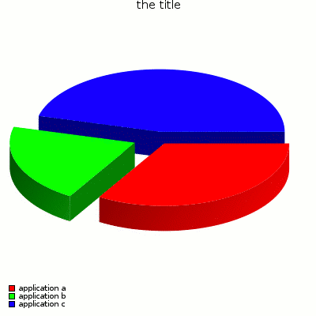

About Pie
=========
Is a tool for building pie charts in format PNG, EPS, PDF or SVG. My original usage
of this code is for building automatically LaTeX documents.

[Original project page](https://www.arpalert.org/pie.html)



Build
=====
This buils needs include file and libs for

cairo (http://cairographics.org/)
Just type "make". Maybe you can adjust path in the makefile.

Command line help
=================

```
Syntax: pie -o <file> [-b <hex>] [-c <float>] [-C <hex>] [-d <float>]
            [-e <float>] [-f <EPS|PNG|PDF|SVG>] [-h <integer>] [-i <file>]
            [-l <hex>] [-L <float>] [-m <float>] [-r <float>] [-s <size>]
            [-t <title>] [-T <hex>] [-w <float>] [val [val [val [...]]]]

 -b <hex>             : Background color (ex: #ffffff). Default is
                        transparent
 -c <float>           : Pie line width. Default is 0
 -C <hex>             : Pie line color. Default is black
 -d <float>           : Percent explode.
                        Values must between 0 and 1. default is 0.1
 -e <float>           : Percent extrusion (pie height).
                        Values must between 0 and 1. Default is 0.4
 -f <EPS|PNG|PDF|SVG> : Choose output format. Default is PNG
 -h <integer>         : Height in pixel. Default is equal than -w. If
                        -h is not defined, is 400px
 -i <file>            : Input data file
 -l <hex>             : Legend color (ex: #ffffff). Default is black
 -L <float>           : Legend size in px. Default is 10px
 -m <float>           : Margin in pixel. Deafult is 10px
 -o <file>            : Output file name. '-' is stdout
 -r <float>           : Ratio between height and with of pie.
                        Values must between 0 and 1. default is 0.5
 -s <size>            : Title size in px. Default is 15px
 -t <title>           : Graph title. Default is empty
 -T <hex>             : Title color (ex: #ffffff). Default is black
 -w <float>           : Width in pixel. Default is equal than -h. If
                        -h is not defined, is 400px

Values format is: value<float>#color<hex>:ratio_explode<float>:name

Exemple:
  pie -f PNG -w 400 -h 400 -o toto.png -l '#000000' -L 10 -t 'the title' \
        -b '#ffffff' -r 0.5 \
        "33#ff0000:0:application a" \
        "20#00ff00:0.1:application b" \
        "45#0000ff:0:application c"
```
